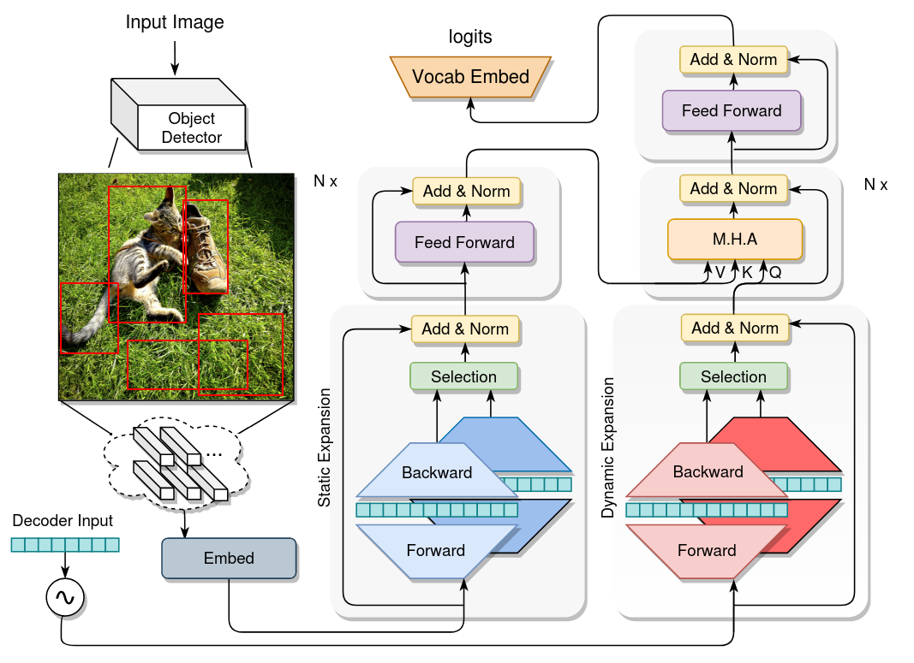

## ExpansionNet: exploring the sequence length bottleneck in the Transformer for Image Captioning

This repository contains the implementation code of [ExpansionNet: exploring the sequence length bottleneck 
in the Transformer for Image Captioning](https://arxiv.org/abs/2207.03327v1). <br>

DOI: https://doi.org/10.48550/arXiv.2207.03327

<p align="center">
  
</p> 

## Requirements
* python >= 3.5 
* cuda 10
* numpy
* java 1.8.0
* pytorch 1.6.0
* tensorboard
* opencv-python
* h5py

## Data preparation

The MS-COCO 2014 visual inputs are gently provided by 
[here](https://github.com/peteanderson80/bottom-up-attention), where features are extracted by a Faster-RCNN 
using the ResNet-101 backbone. The data can be converted into the required format of 
this repository using our `features_generation.py` script by specifing the source file location:
```
features_generation.py --tsv_features_path src_file_path
```

Compressed captions file can be downloaded [here](https://drive.google.com/drive/folders/1z-kVvVsOhcW6QSPqB27h5ta5XsRGG5sv?usp=sharing) and is 
suggested to be extracted in the directory `github_ignore_material/raw_data/`, the default directory serving the purpose of
storing heavy data. <br>

## Training

We provide a training configuration for both Cross Entropy training and CIDEr-D optimization 
that worked well for our hardware setup. Once features are extracted and moved in the `github_ignore_material/raw_data/`
directory, the pre-training phase can be started by executing the following command in the repository directory: 

```
python distributed_train.py $(cat results/xe.conf)
```

During the process, checkpoints are automatically saved in  `github_ignore_material/saves/`. 
Before running the reinforcement learning, we suggest to
make a copy of the last cross entropy save point since it will be overwritten
in the optimization step, which is started by the 
following command:

```
python distributed_train.py $(cat results/rf.conf)
```

We are aware results may be slightly different compared to the paper
due to the stochastic nature of the training, for this reason, a pretrained model is 
provided 
[here](https://drive.google.com/drive/folders/1z-kVvVsOhcW6QSPqB27h5ta5XsRGG5sv?usp=sharing).
 Additionally, captions generated using ExpansionNet on the test split are provided in the 
`res_test_karpathy.json` file. <br>


## Evaluation

Once training is completed, checkpoints can be passed to the testing script
`distributed_test.py`. For instance, if features are extracted in the default directory 
and the pre-trained model is moved in the `github_ignore_material/saves/` folder,
 the evaluation is performed by:

```
python distributed_test.py --N_enc 3 --N_dec 3 --enc_expand_n 64 --dec_expand_n 16
        --num_gpus 1 --ddp_sync_port 12390 --eval_parallel_batch_size 4 --eval_beam_sizes [5] --model_dim 768 --is_ensemble False 
        --save_path ./github_ignore_material/saves/pretrained_model.pth 
        --features_path ./github_ignore_material/raw_data/mscoco2014_features.hdf5 
```

<b>

## Acknowledgments

We thank the awesome PyTorch team and the following repositories:
* https://github.com/ruotianluo/ImageCaptioning.pytorch
* https://github.com/JDAI-CV/image-captioning
* https://github.com/husthuaan/AoANet
* https://github.com/peteanderson80/bottom-up-attention
<br></br>


